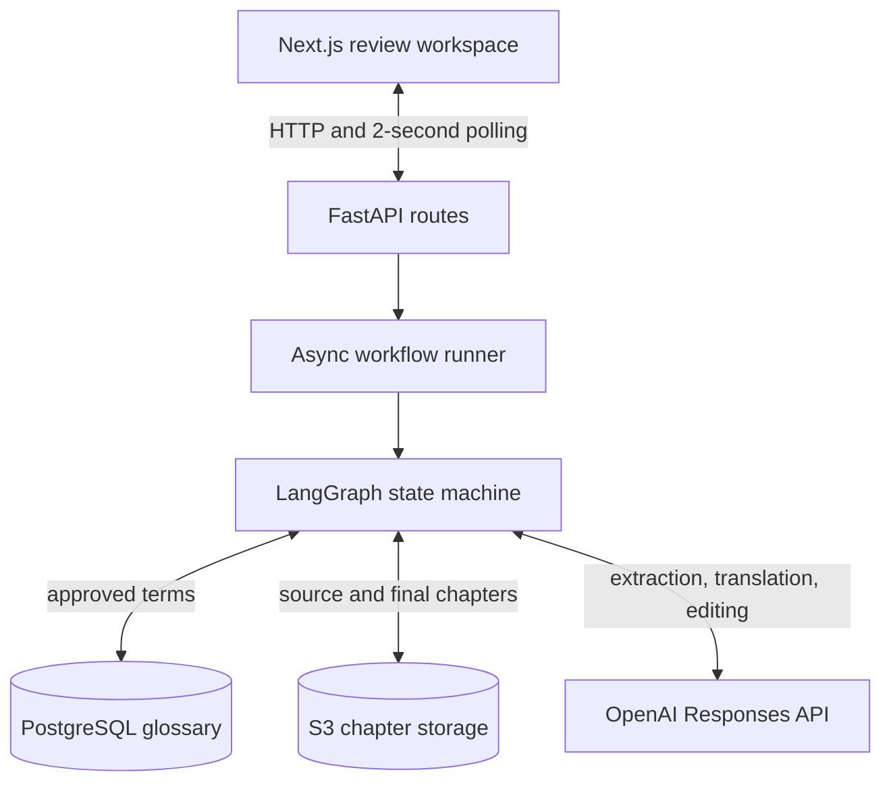
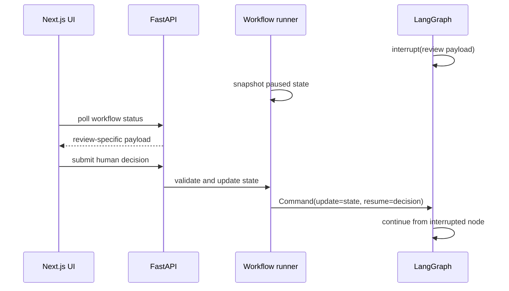

# Architecture

## Overview

AI Novel Translation is a desktop-first review workspace for translating Chinese novel chapters into English. FastAPI starts and controls an asynchronous LangGraph workflow; Next.js presents chapter selection and human review checkpoints; PostgreSQL stores approved terminology; S3 stores source and approved translated chapters.

The architecture is designed around one principle: **automation may propose and transform, but humans approve terminology and final prose**.



## Runtime Topology

Docker Compose runs three local services:

| Service | Responsibility | Local port |
|---|---|---|
| `frontend` | Next.js single-page review workspace | `5173` |
| `backend` | FastAPI, LangGraph execution, LLM and storage integrations | `8000` |
| `postgres` | Approved glossary persistence | `5432` |

LangGraph runs inside the FastAPI process. Starting or resuming a workflow schedules `graph.ainvoke(...)` through `asyncio.create_task`, allowing HTTP requests to return without waiting for the graph to finish.

The backend holds active state in:

- `state_store`: a module-level map from workflow ID to the latest `WorkflowState`.
- LangGraph `InMemorySaver`: checkpoints used by human-review interrupts.
- `_tasks_by_workflow`: active asynchronous tasks used for cancellation.

These stores are process-local. A backend restart loses all active workflows.

## Workflow Graph

The graph is defined in `backend/src/novel_translation_backend/graph/graph.py`.


### Node responsibilities

| Node | Reads | Writes and effects |
|---|---|---|
| `s3_retrieval` | Novel and chapter identifiers | Fetches raw source text; sets `fetching` |
| `glossary_extractor` | Raw source text | Extracts structured proposals and replaces exact matches with approved DB terms |
| `hitl_glossary` | New glossary proposals | Interrupts until every new term is reviewed |
| `glossary_db_write` | Reviewed glossary terms | Inserts newly approved terms and removes rejected terms from workflow state |
| `translator` | Raw text and approved glossary | Produces English text and glossary-consistency warnings |
| `editor` | Translation or previous edited text plus feedback | Produces validated edited text, retries formatting failures, records warnings |
| `hitl_final` | Edited text and reviewer decision | Interrupts for AI revision or approval of manually reviewed final text |
| `complete` | Final approved text | Saves create-only translated object and marks workflow complete |

If extraction produces no new terms, the graph skips glossary review. Approved glossary terms still continue to translation.

## State And Ownership

`WorkflowState` is a dependency-free `TypedDict` passed between graph nodes and used as the backend's source of truth for an active workflow.

```text
Identity and status
  workflow_id, novel_name, chapter_number, status

Chapter content
  raw_chinese_text, translated_text, edited_text, final_text

Glossary
  glossary_terms

Review and quality
  editor_feedback, editor_revision, warnings

Operations
  created_at, completed_at, model_used
  error_detail, error_stage, error_code
```

Content versions remain separate:

- `raw_chinese_text` is the immutable S3 source.
- `translated_text` is the translator model output.
- `edited_text` is the latest editor model output.
- `final_text` is the human-reviewed text approved for storage.

The API never returns the full state object. Status responses expose only the data required by the current UI stage.

## Human-In-The-Loop Flow

Both review checkpoints use LangGraph's `interrupt()` primitive.



### Glossary review

The UI displays only terms marked `is_new`. Every extracted term requires an explicit approve or reject decision. Reviewers can edit proposed English translations and add missed terms. Newly approved terms are persisted before translation; rejected terms are dropped and are not persisted.

### Final review

The UI presents independently scrolling source and edited-English panels. A reviewer can:

- Request another AI editor pass with feedback of at least ten characters.
- Start manual editing, approve the edited final text, and continue to storage.

The revision route loops from `hitl_final` back to `editor`. Approval routes to `complete`.

## LLM Pipeline

The application calls the OpenAI Responses API through one shared client.

| Task | Model | Output contract |
|---|---|---|
| Glossary extraction | `gpt-5.4-nano` | JSON array with Chinese term, proposed English, and short description |
| Translation | `gpt-5.4-mini` | Non-empty English chapter using approved terminology |
| Editing | `gpt-5.4-nano` | Non-empty edited chapter satisfying formatting validation |

Prompts are versioned as package resources under `backend/src/novel_translation_backend/prompts/`. Each node verifies required prompt markers and rejects prompts over 20,000 characters.

The editor makes up to three total attempts when formatting validation fails. If validation still fails, the latest edited text continues to human review with a warning instead of blocking the workflow.

The translator also warns when a source chapter contains an approved Chinese term but the expected approved English translation is absent from its output.

## Persistence Boundaries

### PostgreSQL glossary

The `glossary` table stores approved, novel-scoped terminology:

| Column | Purpose |
|---|---|
| `id` | UUID primary key |
| `novel_name` | Scope for terminology consistency |
| `chinese`, `english`, `description` | Approved term and context |
| `translated_at_chapter` | Chapter where the term was first approved |
| `status` | Database-supported values are `pending_review` and `approved` |
| `created_at`, `updated_at` | Audit timestamps |

During extraction, the repository loads only exact approved matches among the terms identified in the current chapter. Downstream nodes use the glossary already present in workflow state and do not re-query the database.

New approvals are inserted in one transaction. Existing Chinese terms for the same novel are not overwritten.

### S3 chapter storage

```text
s3://<bucket>/
├── raw/<novel-name>/chapter-0001.txt
└── translated/<novel-name>/chapter-0001.txt
```

Chapter keys use at least four digits. Raw chapters are read-only from the application's perspective.

Translated chapter saves are create-only:

1. Attempt a conditional S3 write using `IfNoneMatch="*"`.
2. If the object already exists, fetch it.
3. Treat identical text as an idempotent success.
4. Raise a conflict when existing text differs.

The chapter catalog lists raw chapters and marks each as translated when a matching translated object exists.

## API And Frontend Flow

### Endpoints

| Method | Path | Responsibility |
|---|---|---|
| `GET` | `/api/chapters` | Return novels, raw chapters, and translated status |
| `GET` | `/api/chapters/{novel_name}/{chapter_number}` | Return raw and translated text for read-only comparison |
| `POST` | `/api/workflow/start` | Validate input, create initial state, and schedule the graph |
| `GET` | `/api/workflow/{workflow_id}/status` | Return stage-specific workflow payload |
| `POST` | `/api/workflow/{workflow_id}/kill` | Remove state and cancel active graph tasks |
| `POST` | `/api/workflow/{workflow_id}/retry-save` | Retry a temporary complete-stage save failure |
| `POST` | `/api/review/glossary` | Validate glossary decisions and resume the graph |
| `POST` | `/api/review/editor` | Validate feedback and resume toward another editor pass |
| `POST` | `/api/review/final` | Store approved final text and resume toward saving |

### Stage-specific status payloads

The frontend polls status every two seconds and stops on `complete` or `error`.

- `glossary_review` exposes only new glossary proposals.
- `final_review` exposes raw source, edited text, revision count, and warnings.
- Complete-stage errors expose the preserved final text and structured error fields.
- Other processing stages expose status and warnings without chapter content.

The single-page workspace renders chapter selection, loading, glossary review, final review, completion, read-only comparison, or error recovery from local React state and the current status response.

The workflow ID is not persisted in browser storage. Refreshing the page returns the user to chapter selection.

## Failure Handling

The runner wraps each graph invocation and maps unhandled exceptions to `status="error"` so polling does not remain frozen on an earlier stage.

Complete-stage failures receive structured classifications:

| Error code | Meaning | UI behavior |
|---|---|---|
| `save_failed` | Temporary or unknown storage failure | Preserve final text and offer retry |
| `save_conflict` | A different translated object already exists | Preserve final text and prevent overwrite |

Cancellation removes the workflow from `state_store` and cancels its tracked asynchronous tasks. Duplicate active workflows for the same novel and chapter are rejected.

Warnings are non-blocking. They remain visible during final review so the human can resolve quality concerns before approval.

## Security And Operational Notes

- Secrets are loaded from environment variables and are not stored in the repository.
- CORS permits the local frontend origin `http://localhost:5173`.
- S3 access is programmatic; LLMs never receive AWS credentials or choose storage keys.
- Source and translation text are sent to the configured OpenAI API models during processing.
- FastAPI's unhandled exception response currently includes the exception detail. A production deployment should replace this with sanitized client messages and structured server-side logging.

## Known Limitations And Next Steps

- Persist LangGraph checkpoints and workflow state so active work survives backend restarts.
- Persist rejected glossary terms to suppress repeated proposals.
- Replace string-based novel names with a `novels` table and foreign keys.
- Add authentication, authorization, and audit history for reviewer actions.
- Add automated frontend and end-to-end workflow tests.
- Add production observability, rate limiting, and sanitized error responses.
- Support controlled updates and version history for previously translated chapters.
